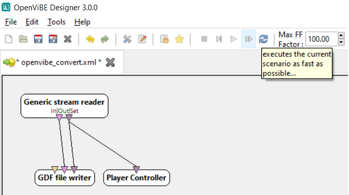

# Convert OpenVibe to EEGLab

Openvibe is great, EEGLAB is also great but it's not easy to switch between them

(Matlab is only required if you want to modify events)

## Openvibe to GDF 

Convert the .ov file to .gdf using the scenario [openvibe_convert.xml](scripts/openvibe_convert.xml) from Openvibe. Make sure to change the path of input and output files by double clicking the boxes.

Use the **fast-forward** option

## Read GDF via EEGLAB

### Without matlab (*only signal and event display*)

- Download EEGLAB standalone
- Open the gdf file via the BIOSIG toolbox
- apply a FIR filter to compensate the lack of drift correction
- plot data

### With matlab (*for event renaming, filtering or using ERPLab*)

- Modify and execute [gdf_eeglab_display.m](gdf_eeglab_display.m)
  - set the EEGLAB path
  - check the EEG.event variable for the stimuli needed
  - tweak the stimuli rename and filtering lines

